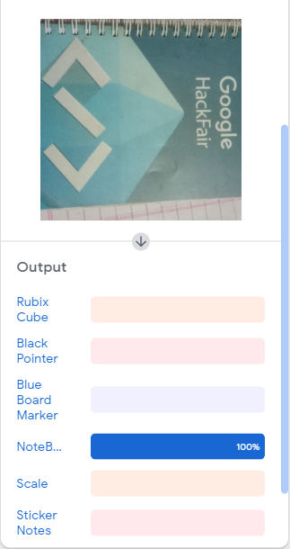
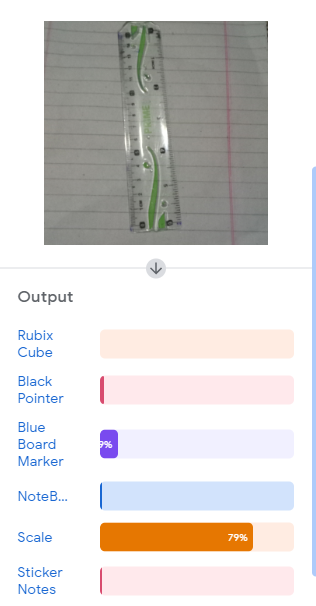

How to Run
Project Status. 
Here 4 project file +Java script code File Download and run on Different platforms.

Teachable Machine-Site
1.	Download this project.tm file and open on teachable machine website.
2.	Download Project Module Zip file and Open in Pycharm Software.

